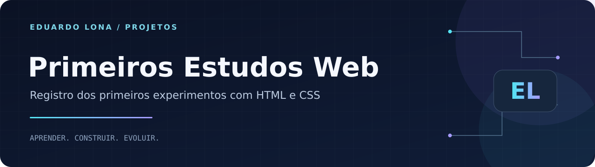

<strong>HTML · CSS · JavaScript · Exercício acadêmico</strong>

<a href="#sobre">Sobre</a> · <a href="#como-executar">Como executar</a> · <a href="https://github.com/Dudulonabr">Perfil do autor</a>

# Primeiros Estudos Web

## Sobre

Registro dos meus primeiros experimentos de apresentação pessoal com **HTML, CSS e JavaScript**. O projeto explora navegação por seções, efeito de digitação e imagens/GIFs em um layout de estudo.

O conteúdo da página e os links sociais pertencem ao exercício e podem usar exemplos ou imagens de demonstração. Minha apresentação profissional atual está no [Portfólio](https://github.com/Dudulonabr/Portifolio).

## Aprendizados

Estrutura HTML, estilos externos, menus, links, imagens, posicionamento e interação básica com JavaScript.

## Como executar

Clone o repositório e abra `index.html` no navegador. Os estilos estão em `css/estilo.css` e as imagens locais em `img/`. Recursos externos dependem de internet.

## Autor

**Eduardo Moreira Monteiro Lona** · São Paulo, Brasil

Estudante de **Análise e Desenvolvimento de Sistemas (UNIP)** e **Engenharia de Software (Cruzeiro do Sul)**, com formação técnica em **Informática pelo SENAC**.

[LinkedIn](https://www.linkedin.com/in/eduardo-moreira-monteiro-lona) · [E-mail](mailto:dudulona07@gmail.com) · [GitHub](https://github.com/Dudulonabr)
